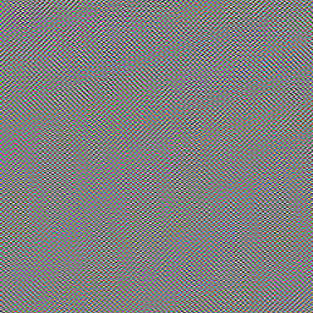

# jpggen

Generate surprisingly structured images by sampling random (but biased) JPEG
DCT coefficients and letting the decoder reconstruct them. Supports color
(YCbCr 4:4:4) and grayscale, with “waves” patterns for coherent global
structure or fully random per-block coefficients.

## Introduction

Compression and prediction are symmetric. A perfect compressor is a perfect
predictor, and vice versa. Therefore, compression algorithms can be used as
generative algorithms by sampling random data from simple distributions and
decompressing, conjuring structure from noise. Standard compression algorithms,
such as the one used by JPEG, can be used as generative “AI.” The structure of
the generated images reveals how JPEG models the distribution of images. JPEG,
being hand-designed, has a less interesting model of the image world than
something such as image diffusion models, but interesting patterns emerge.

## Example

The image below was generated with the default settings:



Command used:
```bash
cargo run --release -- --output example.jpg
```

## Build and install

- Prerequisites: Rust (stable)
- Build:
  ```bash
  cargo build --release
  ```
- Run:
  ```bash
  cargo run --release -- -o out.jpg
  ```

## Usage

Usage:
```text
jpggen [OPTIONS] --output <PATH>
```

Options:
- Output and size
  - -o, --output <PATH>       Output JPEG path (required)
  - -w, --width <PX>          Image width in pixels (default: 512)
  - -H, --height <PX>         Image height in pixels (default: 512)

- Determinism
  - --seed <u64>              Seed for reproducibility (optional)

- Pattern of coefficients
  - --pattern <waves|random>  Coefficient pattern (default: waves)
    - waves: coherent global sine modulation across blocks
    - random: independent random ACs per block
  - --num-waves <N>           Waves mixed per active AC index (default: 3; waves only)

- Frequency selection
  - --nonzero <N>             Number of active AC positions
                              - waves: how many AC indices are active globally
                              - random: approximate non-zeros per block
                              (default: 4)
  - --freq <low|all>          Restrict which AC positions are used (default: low)
  - --low-span <1..63>        If --freq low, use zig-zag indices 1..=low-span (default: 12)

- Amplitude and JPEG quality
  - --max-ac-bits <1..10>     Max AC category (amplitude range); higher = stronger (default: 6)
  - --quality <1..100>        JPEG “quality” scaling (default: 50)

- Components and DC behavior
  - --grayscale               Force grayscale (single-component JPEG)
  - --dc-random-walk          Add a tiny DC random walk (slow gradients)

Examples:
- Default color, waves:
  ```bash
  cargo run --release -- -o waves.jpg -w 1024 -H 768 --seed 42 \
    --nonzero 6 --freq low --low-span 12 --quality 45 --num-waves 4
  ```
- Trippier color (stronger amplitudes):
  ```bash
  cargo run --release -- -o waves_strong.jpg --seed 7 \
    --nonzero 8 --max-ac-bits 8 --quality 40 --num-waves 5
  ```
- Grayscale, random per-block ACs:
  ```bash
  cargo run --release -- -o random_gray.jpg --grayscale \
    --pattern random --nonzero 6 --freq all --max-ac-bits 6 --quality 50
  ```

## How it works

- Writes a valid baseline JFIF JPEG with standard Huffman tables and scaled
  quantization tables.
- Instead of starting from pixels, directly samples quantized DCT coefficients
  in zig-zag order.
- DC is optionally a tiny random walk; ACs are either:
  - random: independent selections per block
  - waves: per-index sine modulation over the block grid for global coherence
- The decoder’s inverse DCT “turns” those frequency-domain samples into images
  that reflect JPEG’s hand-designed basis and coding assumptions.

## License

MIT License - see [LICENSE](LICENSE) for details.
